# WiTcontroller

A WiTcontroller is a simple DIY, handheld controller that talks to a WiThrottle Server (JMRI, DCC-EX EX-CommandStation, Digitrax LnWi and many others) using the WiThrottle protocol to control DCC model trains. 

> [See full change log/ version history](change_log.md)

---

**Why WiTcontroller?**

There are a number of excellent DIY DCC controllers available but most require a lot of components and a lot of soldering.  I wanted to create the simplest possible controller so that it would be as easy (as possible) to make one.

In its basic form, the WiTcontroller uses only four components plus a battery.  You can even put it together without soldering, though I don't recommend that for long term use.

While the basic from is simple, the design is flexible and you can add several additional components if you wish.


[See a video of it in use here.](https://youtu.be/RKnhfBCP_SQ)  
[and another...](https://www.youtube.com/watch?v=1w7H2OvP8Jg) (from GingeAngles)
[and another...](https://youtu.be/69rTwZ4NM7E?si=bjXsFOhbpBvZsjaS) (from Sumner)

**The name**

*WiTcontroller* is a contraction of 'WiThrottle Controller' as it uses the WiThrottle Protocol for communications with the server.  I pronounce it as 'Wit Controller', but you can pronounce it however you like.😊

**Notes:**

* 'WiThrottle' is a trademark owned by Brett Hoffman. It is also an iOS app developed by Brett Hoffman.
  
* The 'WiThrottle protocol' is a communications protocol developed by Brett Hoffman.  It is used by **WiTcontroller**, JMRI, Engine Driver, the WiThrottle app plus a number of other apps and DCC Command Stations. References in this document to a 'WiThrottle Server', refer to any server that can communicate using the 'WiThrottle protocol'.
 
---

**Index:**

* [Prerequisites](#prerequisites)
* [Building](#building)
* [Loading the Code](#loading-the-code)
* [Using WiTController](#using-witcontroller)
* [Options and Extras](#options-and-extras)
* [Contact Me](#contact-me) <br/> <br/>
* [Modifying the code](#modifying-the-code)
* [Change Log](#change-log)

---

## Prerequisites

1. Some basic soldering skills.

    The components will work if just plugged together using jumpers, but they take a lot of space that way, so soldering them together is advised to make it more hand held.

2. Loading the code (sketch) requires downloading of one of the IDEs, this sketch, the libraries, etc. so some experience with Arduinos is helpful, but not critical.

3. A WiThrottle Server to connect to. WiTcontroller will work with any WiThrottle Server. e.g.

    * **JMRI**
    * **DCC-EX EX-CommandStation**
    * **MRC WiFi**
    * **Digitrax LnWi**
    * **NCE WiFiTrax**
    * and others

    Note that there seems to be an issue with the **YaMoRC Command Station** that I am still working on.

---

## Building

### Required Components

1. WeMos Lite LOLIN32  (ESP32 Arduino with LiPo charger) ([Example](https://www.ebay.com.au/itm/284800618644?hash=item424f709094:g:-soAAOSwHslfC9ce&frcectupt=true)) 

    *Note: any ESP32 will work but the pinouts may need to be adjusted, and a separate LiPo charger may be required*

2. 3x4 Keypad  ([Example](https://www.jaycar.com.au/12-key-numeric-keypad/p/SP0770?pos=2&queryId=20aedf107668ad42c6fe1f8b7f7a9ca7)) 

    *Note: Alternately a 4x4 keypad can also be used (see optional components below)* 
      
    ***Note: Different keypad manufacturers may arrange the pins on the base of the keypad differently.*** See notes in the [Default Pins for the keypads](#default-pins-for-the-keypads) section below.

3. KY-040 Rotary Encoder Module ([Example](https://www.aliexpress.com/item/1005003946689694.html?albagn=888888&&src=google&albch=search&acnt=479-062-3723&isdl=y&aff_short_key=UneMJZVf&albcp=21520181724&albag=168529973707&slnk=&trgt=dsa-1464330247393&plac=&crea=707854323770&netw=g&device=c&mtctp=&memo1=&albbt=Google_7_search&aff_platform=google&gad_source=1&gclid=Cj0KCQjwiOy1BhDCARIsADGvQnBPdlEVLYbYnLoOnN1p2bdjte0jYmInrgFD0WG16aF3GZtvrWTb6o0aAo8VEALw_wcB&gclsrc=aw.ds)) 

    *Note: The EC11 rotary encoder will also work, but requires a small configuration change in ``config_buttons.h`` (see below)*

4. OLED Display 0.96" 128x64 I2C IIC SSD1306 ([Example](https://www.ebay.com.au/itm/273746192621?ssPageName=STRK%3AMEBIDX%3AIT&_trksid=p2060353.m2749.l2649))

    *Note: The code for the one of the common 1.3" displays is also included (see below).* 
    
    *Note: Some OLED displays up to 2.4 inch will also work (see below)*

5. Polymer Lithium Ion Battery LiPo 400mAh (or larger) 3.7V 502535 JST Connector. ([500mAh Example](https://www.ebay.com.au/itm/133708965793?hash=item1f21ace7a1:g:tlwAAOSwfORgYqYK)) 

    *Note: Any capacity will work, but 400mAh will give about 6 hours of run time.*
    
    ***WARNING: I have found that some batteries come with the positive and negative leads the other way around to the terminals on the ESP32.*** <br/> **Check they are correct before plugging it in.** <br/> The polarity of the battery is easy to swap, by getting a knife blade under the small tabs on the plastic connector and pulling each male socket out. <br/> Take extreme care. ***DO NOT SHORT THE TERMINALS.*** 

6. A Case to put it in. Links to a few different designs are below, but any box will do. My case was 3d printed for me (see below).

7. A Knob ([Example](https://www.jaycar.com.au/35mm-knob-matching-equipment-style/p/HK7766?pos=7&queryId=cbd19e2486968bca41273cc2dbce54a4&sort=relevance))

8. Wire - If you plan to solder the connections, which is the recommended approach, then stranded, coloured wire is advisable.  ([Example](https://www.jaycar.com.au/rainbow-cable-16-core-sold-per-metre/p/WM4516))

### Optional Components

9. *Optional:* A power switch. Push button or toggle. <br/> The battery in WiTcontroller will last a week or two in deep sleep, but you may wish to add a power switch on the positive feed of the battery if you expect to leave it unused for long periods.

10. *Optional:* You can use a 4x4 keypad instead of the 3x4 keypad. <br/> Note: You will need to make a small configuration change in ``config_buttons.h`` for this to work correctly.

11. *Optional:* Up to eleven (11) additional push buttons can be added directly to the ESP32, each with their own independent commands. ([Example](https://www.jaycar.com.au/red-miniature-pushbutton-spst-momentary-action-125v-1a-rating/p/SP0710))

12. *Optional:* A 1.3" or 2.4" OLED Display (128x64) can be used instead of the 0.96" OLED Display 128x64 ([Example](https://www.aliexpress.com/item/32683094040.html?spm=a2g0o.order_list.order_list_main.110.25621802jRBB7y)) Note: You will need to make a minor change in the config file for this to work correctly.

13. *Optional:* It is possible to use a Potentiometer instead of the Rotary Encoder for throttle control.  The code supports it if you make the appropriate configuration changes in ``config_buttons.h``.   However this has had only limited testing. <br/> This is documented to some degree in ``config_buttons_example.h`` if you wish to try it.

### Pinouts

*Standard Configuration Pinouts*  <br/> This is the simplest form of the WiTcontroller


*Pinouts for Optional Additional Buttons*


*Pinouts for Optional Additional Buttons - With Pullups*


*Pinouts for Optional 4x4 keypad and Additional Buttons - without pullup resistors*


*Pinouts for Optional Battery Monitor and Additional Buttons*


***Warning: Different keypad manufacturers may arrange the pins on the 
base of the keypad differently.*** See notes in the [Default Pins for the keypads](#default-pins-for-the-keypads)  section below.

---

### Default Pins

#### Default ESP32 and WiTcontroller pins

<details>

<summary>Click to expand to see a table of the default pinouts</summary>

```
         3x4    4x4    OLED Encoder  Additional   Battery
    Pin Keypad Keypad                  Buttons     Test
     0    C1     C1                             
N/A  1                                       
     2    C2     C2                             
N/A  3                                     
     4    C0     C0                             
     5                                  AB0     
N/A  6                                      
N/A  7                                      
N/A  8                                      
N/A  9                                      
N/A 10                                       
N/A 11                                       
    12                        DT               
    13                        SW               
    14                        CLK               
    15                                  AB1     
    16     R3     R3                             
    17     R2     R2                             
    18     R1     R1                             
    19     R0     R0                             
N/A 20                                       
N/A 21                                       
    22                  SLC                     
    23                  SDA                     
N/A 24                                       
    25                                  AB2     
    26                                  AB3     
    27                                  AB4     
N/A 28                                       
N/A 29                                       
N/A 30                                       
N/A 31                                       
N/A 32                                  AB5     
    33          C3                      AB6     
    34                                  AB7 *        BT
    35                                  AB8 *     
VP  36                                  AB9 *     
N/A 37                                       
N/A 38                                       
VN  39                                  AB10*     

* Requires an external pullup resistor
```
</details>

<br />

#### Default Pins for the keypads

<details>

<summary>Click to expand to see a table of the Default Pins for the keypads</summary>

```
3x4 Keypad - Left to Right    4x4 keypad - Left to Right
 C1 PIN 0                      C0 PIN 4
 R0 PIN 19                     C1 PIN 0
 C0 PIN 4                      C2 PIN 2
 R3 PIN 16                     C3 PIN 33
 C2 PIN 2                      R0 PIN 19
 R2 PIN 17                     R1 PIN 18
 R1 PIN 18                     R2 PIN 17
                               R3 PIN 16

Note:
Different keypad manufacturers may arrange the pins on the 
base of the keypad differently to those listed above.  
So it is important to make sure the pins on the keypad are 
correctly identified and adjusted as needed.

 ```
 
</details>

---

### Case

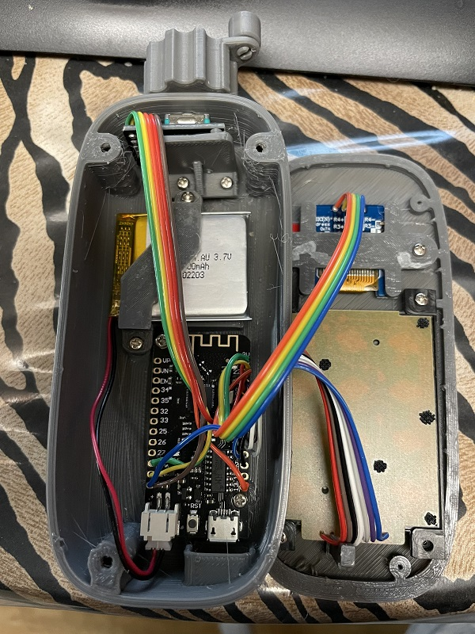


My case was 3D Printed for me by peteGSX (See the [Thingiverse.](https://www.thingiverse.com/thing:5440351) )

* The 3x4 keypad petGSX designed the case for came from Jaycar and is slightly narrower than the one you see in the 'deconstructed' view in the video above.
* The case requires about a dozen M2x4mm screws

---

### Variations

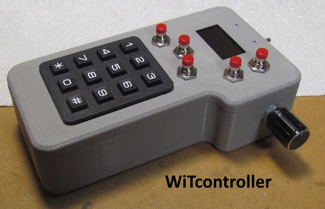
See [*sumner* version](https://1fatgmc.com/RailRoad/DCC/WiTcontroller-Index.html).

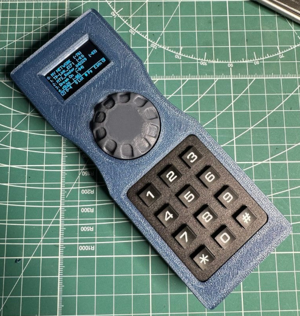
See [Thingiverse](https://www.thingiverse.com/thing:6541187).

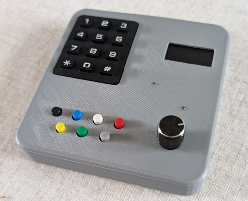
See [RMweb](https://www.rmweb.co.uk/forums/topic/186297-project-a-witcontroller-wireless-throttle-to-control-my-dcc-ex-commandstation/).

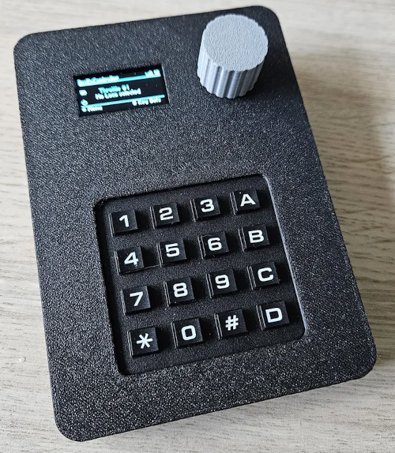
See [printables](https://www.printables.com/model/907658-dccexcontroller-witcontroller).

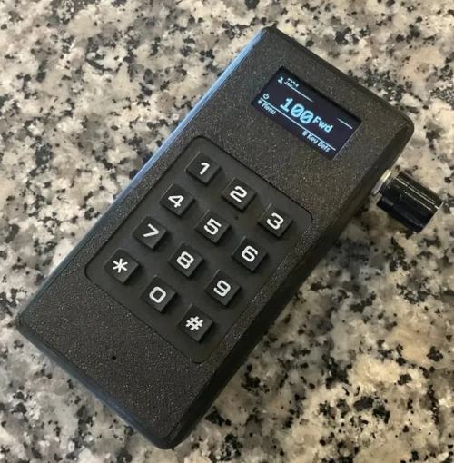
See [Thingiverse](https://makerworld.com/en/models/819825).

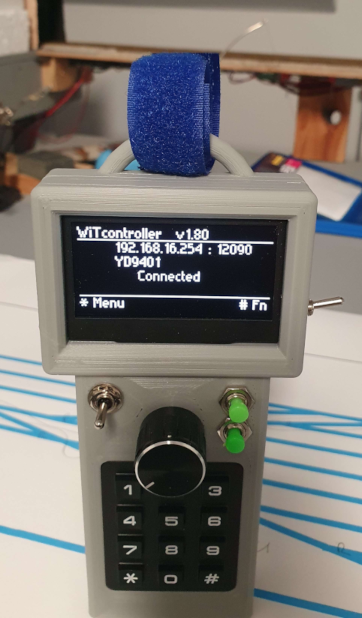
*gingerangles* version with 2.4 inch screen...

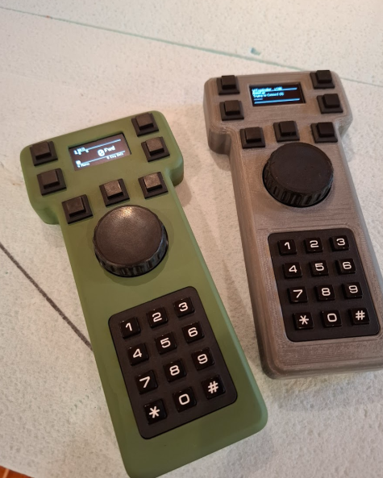
See [Thingiverse](https://www.thingiverse.com/thing:6956982)

---

Some videos:

* https://youtu.be/RKnhfBCP_SQ
* https://www.youtube.com/shorts/1w7H2OvP8Jg

---

And for a very different take on what is possible by extending the design, have a look at: https://1fatgmc.com/RailRoad/DCC/HandCab-Index.html


<br/>

---

<br/>

---

## Loading the code

The instructions below are for using the **Arduino IDE** and **GitHub Desktop**. 

**Visual Studio Code (VSC)** can be used instead of the Arduino IDE, and is actually my preferred IDE, but no instructions are included here.

1. Download the Arduino IDE.
    * Available from  https://support.arduino.cc/hc/en-us/articles/360019833020-Download-and-install-Arduino-IDE

2. Download the **esp32** boards in the Arduino IDE.
    * Add the esp322 support with the following instructions:  (See here for detailed instructions:  https://randomnerdtutorials.com/installing-the-esp32-board-in-arduino-ide-windows-instructions/)
        * In the Arduino IDE, go to *File* > *Preferences*
        * Enter the following into the 'Additional Board Manager URLs' field:  https://dl.espressif.com/dl/package_esp32_index.json
    * Then Use the *Boards Manager* in the *Arduino IDE* to install the esp32 board support
        * *Tools* > *Board* > *Boards Manager*
        * Search for "esp32" by Expressive Systems.  Install version 2.0.11 or later. (Later versions work, but go back to this 2.0.11 if you have problems.) Version 3.2.0 is recommended, and required if you need to use 2.4gHz WiFi channels greater than 10. See notes below.

3. Download or clone *this* repository. <br/> (Note: if you 'clone' initially, it is easier to receive updates to the code by doing a 'fetch' subsequently.  See Notes below.)
    * Option - Clone - **First Time**  ***Recommended***
       * Install *GitHub Desktop* from https://desktop.github.com/
       * Create a free account on GitHub and authorise the app to allow it to connect top GitHub
       * Select *file* -> *Clone Repository* - or 'Clone an repository from the internet' from the welcome page then select the 'URL' tab
       * Enter *https://github.com/flash62au/WiTcontroller* as the URL
       * Select a local folder to install it.  The default folder for the Arduino usually looks like "...<username>\Documents\Arduino\". (This is a good but not essential place to put it.)
       * Click *Clone*
       * **Subsequently**  (Anytime after the first 'clone')
         * click *Fetch Origin* and any changes to the code will be bought down to you PC, but you config_buttons.h and config_network.h will not be touched.
    * Option - Download ***Not Recommended***
       * Open *https://github.com/flash62au/WiTcontroller*
       * Click the green "Code" button and select download zip
       * Extract the zip file to a local folder.  The default folder for the Arduino usually looks like "...<username>\Documents\Arduino\". This is a good, but not essential, place to put it.

4. Load the needed libraries to your PC. <br/> These *MUST BE* loaded from the *Library Manager* in the *Arduino IDE*. 
    * *U8g2lib.h* -  Search for "U8g2".   Install version 2.35.30 or later. <br/> (later versions should work, but go back to this 2.35.30 if you have problems.)
    * *AiEsp32RotaryEncoder.h* - search for "Ai Esp32 Rotary Encoder".  Install Version 1.6
    * *Keypad.h* - Search for "Keypad" by Mark Stanley.  Install version 3.1.1 or later. <br/> (later versions should work, but go back to this 3.1.1 if you have problems.)
    * *WiThrottleProtocol.h* - Search for "WiThrottleProtocol" (not "WiThrottle").  Install the latest version available. <br/> (see *version notes* below for which versions of WiTcontroller require which versions of the library.)
    
      Note: <br/> **DO NOT** download these libraries *directly*. Use the *Library Manager*. <br/> **DO NOT** put them in the WiTcontroller folder.

5. These should have been automatically installed when you downloaded the esp32 boards. <br/> *YOU SHOULD NOT NEED TO DO ANYTHING SPECIFIC TO GET THESE*
    * *WiFi.h*  - https://github.com/espressif/arduino-esp32/tree/master/libraries/WiFi
    * *ESPmDNS.h* - https://github.com/espressif/arduino-esp32/blob/master/libraries/ESPmDNS

      Notes: <br/> **DO NOT** download these libraries *directly*. Use the *Boards Manager*. <br/> **DO NOT** put them in the WiTcontroller folder. <br/> These libraries do not appear in your list of libraries, but will be available to use regardless. (The files are actually buried away in a subfolder of the ESP32 Boards library.)

6. Copy the two example config files. <br/> You will need to use a *File Manger* type of app on the PC to do this.
    * Copy ``config_network_example.h`` to a new file to ``config_network.h``. 
    * Copy ``config_buttons_example.h`` to a new file ``config_buttons.h``.

      Note: <br/> These new files are not included in the download, so that you can personalise your configuration without fear that those configurations will be overridden if you update (download again) the WiTcontoller code.

7. Open the Arduino IDE and **THEN** find and open the ``WiTcontoller.ino`` file.

      Note: <br/> *If you open the file **from** the IDE*, rather then opening it from a File Manager, will automatically open *all the files in the WiTcontroller folder* in the IDE. 
      
      Whereas, *if you open it from a File manger app* (by double clicking on it) only open the file you selected will open.

8. Edit your personal ``config_network.h`` file. 
    * Edit it to include the network SSIDs you want to use.  (Not essential, but entering passwords via the encoder is tedious.)

9. Edit your personal ``config_buttons.h`` file.
    * Optionally, edit this to change the mapping of the keypad buttons to specific functions.
    * Optionally, edit this to configure the additional buttons (if you have included them) to specific functions.
    * Optionally, edit this to change if you want the function buttons to display when you press #, instead of the default of showing the Key Definitions

10. Upload the sketch.  
    * Select the board type as ``WEMOS LOLIN32 Lite`` in the *Arduino IDE*.
    * Connect the board via USB and select the appropriate port in the *Arduino IDE*.
    * Click ``Upload`` **-->**

### Version Notes

<details>

<summary>Click to expand</summary>

   * WiTcontroller version 1.83 includes a new way to add additional buttons. (see below) The old way will continue to work, but conversion to the new format is recommended. <br/> This change allows up to a total of 11 additional buttons, but some of the extra pins may be in use for the 4x4 keypad, the battery test, etc.
   * WiTcontroller version 1.82 or later requires WiThrottleProtocol version 1.1.26 or later.
   * WiTcontroller version 1.73 or later is recommended to use WiThrottleProtocol version 1.1.25 or later to address a bug in heartbeat send, but only seen with JMRI WiThrottle .
   * WiTcontroller version 1.66 or later requires WiThrottleProtocol version 1.1.24 or later.
   * WiTcontroller version 1.65 or later requires WiThrottleProtocol version 1.1.23 or later.
   * WiTcontroller version 1.57 or later requires WiThrottleProtocol version 1.1.20 or later for the E_STOP and E_STOP_CURRENT_LOCO to work correctly.
   * WiTcontroller version 1.45 or later requires WiThrottleProtocol version 1.1.14 or later.
   * WiTcontroller version 1.41 or later requires WiThrottleProtocol version 1.1.12 or later.
   * WiTcontroller version 1.39 or later requires WiThrottleProtocol version 1.1.11 or later.
   * WiTcontroller version 1.38 or later requires WiThrottleProtocol version 1.1.10 or later.
   * WiTcontroller version 1.35 or later requires WiThrottleProtocol version 1.1.7 or later.
   * WiTcontroller version 1.33 or later requires WiThrottleProtocol version 1.1.6 or later.
   * WiTcontroller version 1.19 - 1.32 requires WiThrottleProtocol version 1.1.3 - 1.1.5 or later.
   * WiTcontroller version 1.06 or later requires WiThrottleProtocol version 1.1.2 or later.
   * WiTcontroller version 1.01 or later requires WiThrottleProtocol version 1.1.0 or later.
   * WiTcontroller version 0.10 or later requires WiThrottleProtocol version 1.0.3 or later.
   * The *WiFi.h* and *ESPmDNS.h* libraries were automatically installed for me when I installed the esp32 boards, however it is possible that you may need to install them manually, but this is seriously not recommended.
   * Later versions of the ESP board support are available and do appear to work, but if you have difficulties version 2.0.11 and 1.0.6 appear to be stable.
   * Later versions of the libraries generally should work, but if you have difficulties use the versions listed above.
   * To get the WiTcontroller sketch I recommend using either the git command line, or the far more friendly 'GitHub Desktop' app.  See instructions above.
   * If you receive and error related to Python, and you are on MacOS 12 and above please edit the platform file, change from python to python3 as follows; preferences->user/path/arduino/packages/hardware/esp32/version/platform.txt and edit the line that looks as follows:tools.gen_esp32part.cmd=python3 "{runtime.platform.path}/tools/gen_esp32part.py"

</details>

<br/>

---

<br/>

---

## Using WiTController

## Be aware of...

### WiFi limitations
 
The ESP32 *cannot use the 5gHz* frequencies.  It is limited to the 2.4gHz  frequencies. 
 
Using 2.4gHz Wifi channels beyond 10 (11-13) is problematic. I have added an experimental set of definitions in ``config_network_example.h`` that allow you to set the country code.  In theory this will allow the use of the additional channels, but requires the use the version 3.2.0 (or later) of the ESP32 board library.  This has had only minimal testing.

## Definitions and Explanations

*WiTcontroller* is deliberately described as a "controller" not a "throttle".  

A "Throttle" can control only one train, which may be one loco, or more than one loco in consist/MU.

*WiTcontroller*, as a "controller", **contains up to six (6) "throttles"**. Each of which can control any number of locos in consist/MU. You can swap between throttles at will (``keypad 5``) to select which locos/consists/MUs you one you are manipulating at a given time. While you can only manipulate one loco/consist/MU at at time, the others continue running at the setting you last gave it.

## Features

**Currently functioning:**
WiTcontroller:
- Provides a list of discovered SSIDs with the ability to choose one. When you select one:
  - If it is one in your specified list (in the sketch), it will use that specified password 
  - If it is a DCC-EX EX-CommandStation in Access Point (AP) mode, it will guess the password
  - Otherwise it will ask to enter the password (Use the rotary encoder to choose each character and the encoder button to select it.  * = backspace.  # = enter the password.) 
- Optionally provides a list of SSIDs with the specified passwords (in the sketch) to choose from
- Auto-connects to the first found WiThrottle Protocol Server if only one found, otherwise 
  - Asks which to connect to
  - If none found will ask to enter the IP Address and Port
  - Guesses the WiThrottle IP address and Port for DCC-EX EX-CommandStations in Access Point (AP) mode
  - Optionally you can add a #define (a preference) to disable this auto connect feature
- Allows On-the-fly consists/MUs
  Allows assigning commands directly to the 1-9 buttons (in the sketch) (see list below)
  - This is done in config_button.h
  - Latching / non-latching for the function is provided by the roster entry of the WiThrottle server
- Optionally uses a potentiometer (pot) instead of the rotary encoder
- Optional ability to assign commands directly to the 1-11 additional buttons (in the sketch) (see list below)
  - These are defined config_button.h
- Provides a command **Menu** (see below for full list) including:
  - Able to select and deselect locos:
    - by their DCC address, via the keypad
      - On NCE systems, a leading zero (0) will force a long address
    - from the first 50 locos in the roster (can be increased)
  - Able to select multiple locos to create a consist
    - Able to change the facing of the additional locos in the consists/MUs (via the 'extra' menu after selection)
  - Able to activate any function (0-31)
    - Showing of the roster function labels (from the WiThrottle server if provided)
    - Quick access to the functions by pressing #. Temporarily enabled via the Extras menu (or permanently enabled in config_button.h)
    - Limited ability to configure which functions are sent to the first or all locos in a consist (defined in config_button.h)
  - Able to throw/close turnouts/points:
    - from the address
    - from the first 50 turnouts/points in the server list
  - Able to activate routes:
    - from their address
    - from the first 50 routes in the server list
  - Set/unset a multiplier for the rotary encoder
  - Power Track On/Off
  - Disconnect / Reconnect
  - Put ESP32 in deep sleep and restart it
  - Option to switch between Single Loco and Consist/MU (Drop before Acquire)
  - Option to save the currently select locos (on multiple throttles) and have them automatically re-acquired on next connection.
  - Option to disable the heartbeat check
- Option to have up to 6 command sequences executed on connection
- Option to automatically acquire a loco if there is only one loco in the roster
- Have up to 6 throttles, each with an unlimited number of locos in consist. <br/> The default is 2 throttles, which can be increased or decreased temporarily via the Extras menu (or permanently enabled in config_button.h)
- Limited dealing with unexpected disconnects.  It will throw you back to the WiThrottle Server selection screen.
- The boundary between short and long DCC addresses can be configured in config_buttons.h. <br/> The default is that 127 and below are Short Addresses.
- The default speed step (per encoder click) can be configured in config_buttons.h
- The controller will automatically shut down if no SSID is selected or entered in 4 minutes (to conserve the battery)
- Relatively easy to add/use translation files.
- Translations files for German and Italian included.

**ToDo:**
- Speed button repeat (i.e. hold the button down)
- Deal with unexpected disconnects better
  - automatic attempt to reconnect
- Keep a list of IP addresses and ports if mDNS doesn't provide any
- Remember SSIDs and manually entered passwords 

### Command menu:
- 0-9 keys = pressing these directly will do whatever has been configured in your ``config_buttons.h`` for them to do, or whatever is the default for that key  (see \# below)
- \* = Menu:  The button press following the \* is the actual command:
  - 1 = Add loco.  
     - Followed by the loco number, followed by \# to complete.  e.g. to select loco 99 you would press '\*199\#'
     - or \# alone to show the roster   \# again will show the next page
  - 2 = release loco:
     - Followed by the loco number, followed by \# to release an individual loco.  e.g. to deselect the loco 99 you would press '\*299\#'
     - Otherwise followed directly by \#  to release all e.g. '\*2\#'
  - 3 = Toggle direction.
  - 4 = Set / Unset a 2 times multiplier for the rotary encoder dial.
  - 5 = Throw turnout/point.  
     - Followed by the turnout/point number, followed by the \# to complete.  e.g. Throw turnout XX12 '\*512\#'  (where XX is a prefix defined in the sketch) 
     - or \# alone to show the list from the server   \# again will show the next page
  - 6 = Close turnout.    
     - Followed by the turnout/point number, followed by \# to complete.  e.g. Close turnout XX12 '\*612\#'  (where XX is a prefix defined in the sketch)
     - or \# alone to show the list from the server
  - 7 = Set Route.    
      - Followed by the Route number, followed by \# to complete.  e.g. to Set route XX:XX:0012 '\*60012\#'  (where \'XX:XX:\' is a prefix defined in the sketch)
      - or \# alone to show the list from the server   \# again will show the next page
  - 0 = Function button. Followed by...
      - the function number, Followed by \# to complete.  e.g. to set function 17 you would press '\*017\#'
      - \# alone, to show the list of functions.
  - 8 = Track Power On/Off.
  - 9 = Extras. Followed by...
      - 0 then \# to toggle the action the the \# key does as a direct action, either to show the direct action key definitions, or the Function labels.  
      - 1 to change the facing of locos in a consist.
      - 3 to toggle the heartbeat check.
      - 4 to increase the number of available throttle (up to 6)
      - 5 to decrease the number of available throttle (down to 1)
      - 6 to Disconnect/Reconnect.  
      - 7 to put into deep sleep
      - 8 Toggle between Single loco and Consist/MU (Drop before Acquire)
      - 9 Save the Currently selected locos so they will be automatically acquired on reconnection
Pressing '\*' again before the '\#' will terminate the current command (but not start a new command)
 - \# = Pressing # alone will show the function the the numbered keys (0-9) perform, outside the menu.
       Optionally, you can configure it so that the the Function labels from the roster show 

Pressing the Encoder button while the ESP32 is in Deep Sleep will revive it.

<br/>

----

### Screens

## WiFI/SSID Connection Screens

*Start-up - browsing for SSIDs*<br />
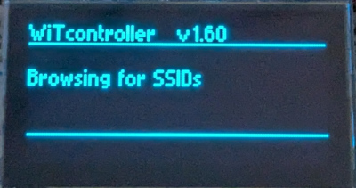

*SSID (WiFi networks) list*<br />
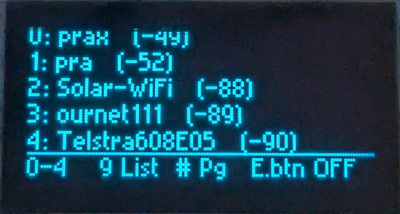

*Trying to to connect to SSID*<br />
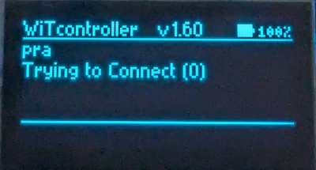

## WiThrottle Server Connection Screens

*WiThrottle Server List*<br />
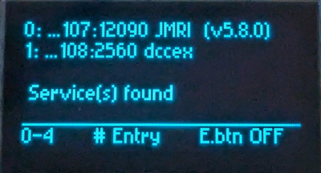


#### Throttle Screen

*Throttle Screen with no loco acquired*<br />
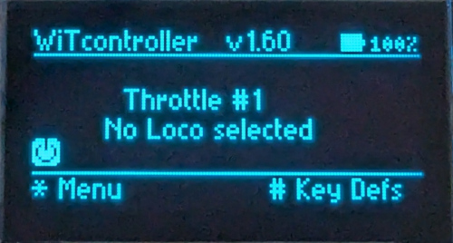

*Throttle Screen - with locos selected on throttle 1 and throttle 2*<br />
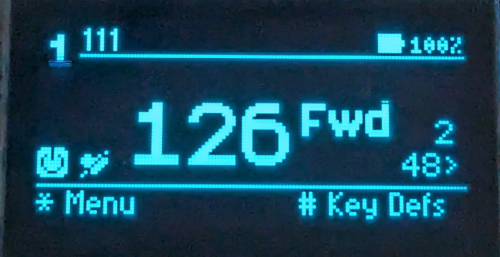

```
TT LLLL LLLL LLLL               BBBBB
TT ----------------------------------
f f f f f f f f f f f f f f f f f f f
              SSSSS  DDDD
              SSSSS  DDDD
              SSSSS            
M             SSSSS              llll
P  h                          d sss d
-------------------------------------
mmmmmmmmm
```

* TT   = Current Throttle Number
* LLLL = Currently acquire loco(s) on this throttle
* SSSS = Speed of current throttle (0-126)
* DDDD = Direction of current throttle (Fwd,Rev)
* f    = State of each of the 32 functions (number displays if the function is active)<br /><br />
* llll = First Loco on *next* available throttle
* d    = Direction of next next available throttle (<,>)
* sss  = Speed of next available throttle (0-126)<br /><br />
* h    = heartbeat (only displays if heartbeat is disabled)
* M    = Speed step multiplier
* P    = Track Power
* BBBB = Optional battery state
* mmmm =  menu, other instructions or broadcast messages

#### * Menu

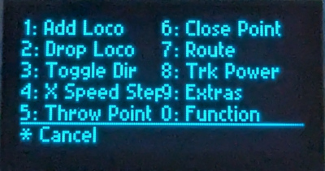

#### # Direct Commands List

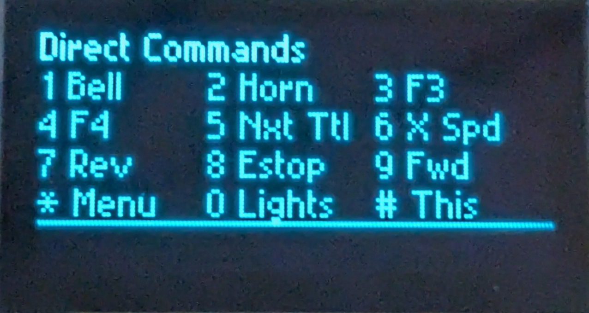

----

### Default number key assignments (0-9)  (outside the menu)

* 0 = FUNCTION_0 (DCC Lights)
* 1 = FUNCTION_1 (DCC Bell)
* 2 = FUNCTION_3 (DCC Horn/Whistle)
* 3 = FUNCTION_3
* 4 = FUNCTION_4
* 5 = NEXT_THROTLE
* 6 = SPEED_MULTIPLIER
* 7 = DIRECTION_REVERSE
* 8 = SPEED_STOP
* 9 = DIRECTION_FORWARD

### Allowed assignments for the 0-9 keys and/or Additional Buttons:

Note: you need to edit config_buttons.h to alter these assignments   (copy config_buttons_example.h)
- FUNCTION_NULL   - don't do anything
- FUNCTION_0 - FUNCTION_31
- SPEED_STOP
- SPEED_UP
- SPEED_DOWN
- SPEED_UP_FAST
- SPEED_DOWN_FAST
- SPEED_MULTIPLIER
- E_STOP   - E Stop all locos on all throttles
- E_STOP_CURRENT_LOCO - E Stop locos on current throttle only
- POWER_TOGGLE
- POWER_ON
- POWER_OFF
- SHOW_HIDE_BATTERY
- DIRECTION_TOGGLE
- DIRECTION_FORWARD
- DIRECTION_REVERSE
- NEXT_THROTTLE
- SPEED_STOP_THEN_TOGGLE_DIRECTION   - stops the loco if moving.  Toggles the direction if stationary.
- MAX_THROTTLE_INCREASE    - change the number of available throttles on-the-fly
- MAX_THROTTLE_DECREASE    - change the number of available throttles on-the-fly
- THROTTLE_1   - change to a specific throttle
- THROTTLE_2   - change to a specific throttle
- THROTTLE_3   - change to a specific throttle
- THROTTLE_4   - change to a specific throttle
- THROTTLE_5   - change to a specific throttle
- THROTTLE_6   - change to a specific throttle
- SLEEP   - put device to sleep
- CUSTOM_1   - There must be already be a command defined as ``#CUSTOM_COMMAND_1 ...``
- CUSTOM_2   - There must be already be a command defined as ``#CUSTOM_COMMAND_2 ...``
- CUSTOM_3   - There must be already be a command defined as ``#CUSTOM_COMMAND_3 ...``
- CUSTOM_4   - There must be already be a command defined as ``#CUSTOM_COMMAND_4 ...``
- CUSTOM_5   - There must be already be a command defined as ``#CUSTOM_COMMAND_5 ...``
- CUSTOM_6   - There must be already be a command defined as ``#CUSTOM_COMMAND_6 ...``
- CUSTOM_7   - There must be already be a command defined as ``#CUSTOM_COMMAND_7 ...``

<br/>

---

## Options and Extras

### Instructions for Optional Additional Buttons 

The way to add additional buttons changed in version 1.83.  The old way will continue to work but only the new way is described here.

To use the new format:
*  ``USE_NEW_ADDITIONAL_BUTTONS_FORMAT`` must be set to ``true``
* ``NEW_MAX_ADDITIONAL_BUTTONS`` must be set to the number of buttons you want to use.  This **must** be ``1`` or more. never 0.

Then the following lists MUST have the same number of elements as NEW_MAX_ADDITIONAL_BUTTONS.

* ``NEW_ADDITIONAL_BUTTON_ACTIONS``
* ``NEW_ADDITIONAL_BUTTON_LATCHING``
* ``NEW_ADDITIONAL_BUTTON_PIN``
* ``NEW_ADDITIONAL_BUTTON_TYPE``

> [!NOTE]
> It is theoretically possible to add up to 11 additional buttons directly to the ESP32. <br/>
> Pins 5,15,25,26,27,32,33 are the 7 normally used for the buttons. <br/>
> However one of these becomes unavailable if you have an optional 4x4 keypad. <br/>
> Also one of these becomes unavailable if you use the battery test. <br/>
> Pins 34,35,36,39 can also be used, *but*: <br/>
> a) they don't have an internal pullup, so need and external resister, and they need to configured (in config_buttons.h) as ``INPUT`` rather than ``INPUT_PULLUP`` <br/>
> b) one of these pins may used by the optional 4x4 keypad <br/>
> c) one of these pins may used by the optional battery monitor

For **NEW_ADDITIONAL_BUTTON_ACTIONS**

  This array lists the functions assigned to the buttons. See the list of 'Allowed assignments' above (or in actions.h).

For **NEW_ADDITIONAL_BUTTON_LATCHING**

  This array lists if the function assigned to the buttons should be latching or not. THis is only relevant if the assigned function is for ``FUNCTION_0`` to ``FUNCTION_31``.

For **NEW_ADDITIONAL_BUTTON_PIN**

  This array lists the pins that the buttons will be attached to.

  * For pins on the ESP32 use the number shown on the board/diagram
  * If you are using pins on a I2C GPIO Expansion board, they will be numbered: 0-15
  * If don't want to use pin, but retain the entry set it to ``-1``.

For **NEW_ADDITIONAL_BUTTON_TYPE**

  This array lists the type of the pin.

  * Set to either INPUT_PULLUP or INPUT.  If INPUT, the pin will need an external pullup resister (e.g. 10k)
  * Pins 34,35,36,39 can be used but don't have an internal pullup, so use INPUT for these

See additional information in ``config_button_example.h``.

---

### Instructions for optional use of a EC11 rotary encoder (with no physical resistor pullups) in place of the KY040 encoder module 

Internal GPIO pullups required if the hardware build utilises a bare EC11 rotary encoder in place of a KY040 encoder module. (The encoder module has physical pullups fitted)

``#define EC11_PULLUPS_REQUIRED         true``

If the ``EC11_PULLUPS_REQUIRED`` is set to ``false`` a KY040 module used in hardware build OR bare EC11 used but with physical pullup resistors 

If the ``EC11_PULLUPS_REQUIRED`` is set to ``true`` an EC11 used for hardware build WITHOUT any physical pullups, GPIO pullups will ne enabled in main

The default is ``false``.

---

### Instructions for optional use of different OLED displays

WitController will support any OLED display with a resolution of 128x64 that is supported by the U8g2 library.  This include displays up to 2.4 inch.

The complete list is available here: https://github.com/olikraus/u8g2/wiki/u8g2setupcpp

The ``OLED_TYPE`` define will need to be updated to whatever display you have

 This is one of the common .9 inch OLED displays (and also for a common 2.4 inch) and is included by default

``#define OLED_TYPE U8G2_SSD1306_128X64_NONAME_F_HW_I2C u8g2(U8G2_R0, /* reset=*/ U8X8_PIN_NONE, /* clock=*/ 22, /* data=*/ 23);``

This is one of the common 1.3 inch OLED displays

``#define OLED_TYPE U8G2_SH1106_128X64_NONAME_F_HW_I2C u8g2(U8G2_R0, /* reset=*/ U8X8_PIN_NONE, /* clock=*/ 22, /* data=*/ 23);``

See ``config_buttons_example.h`` for more information.

---

### Instructions for optional use of a potentiometer (pot) instead of the encoder for the throttle

config_buttons.h can include the following optional defines:

* \#define USE_ROTARY_ENCODER_FOR_THROTTLE false
* \#define THROTTLE_POT_PIN 39
* \#define THROTTLE_POT_USE_NOTCHES true 
\#define THROTTLE_POT_NOTCH_VALUES {1,585,1170,1755,2340,2925,3510,4094}
* \#define THROTTLE_POT_NOTCH_SPEEDS {0,18,36,54,72,90,108,127} 

If ``USE_ROTARY_ENCODER_FOR_THROTTLE`` is set to ``false`` the rotary encoder is ignored and a pot on the pin defined with ``THROTTLE_POT_PIN`` will be used instead.

You must specify the PIN to be used.  Currently PINs 34, 35 and 39 are the only ones that cannot be used by the app for other purposes, so these are the safest to use.  This should be connected to the centre pin of the pot. The 3v and GND should be connected to the outer pins of the pot.

The pot can be set to have 8 defined 'notches' (the default) or just a linear value.

If you want to have the 8 notches:

a) You must define the values the pot will send at each of 8 points - ``THROTTLE_POT_NOTCH_VALUES``.  Note that you should avoid the value zero (0) for notch zero.  Use at least 1 instead.

  The example values above are useble for a 10k ohm pot but any value pot can be used. Just adjust the numbers.

b) You must define what speed should be sent for each notch - ``THROTTLE_POT_NOTCH_SPEEDS``

If you want a linear speed instead of notches:

a) You must define the values the pot will send at at zero throw and full throw in the first and last of the 8 values in ``THROTTLE_POT_NOTCH_VALUES``.  The other values will be ignored but you still need to include 8 values.  (They can be zero.)  Note that you should avoid the value zero (0) for notch zero.  Use at least 1 instead.

Sumner Patterson has developed an app to help find the appropriate pot values for the ``THROTTLE_POT_NOTCH_VALUES``.

---

### Instructions for optional use of a voltage divider to show the battery charge level

See diagram above for how to wire in the volage divider.  47k resistors are used, but this can be varied as long as the output to the pin is limited to below 3.3v. See additional information related to the Pangodream Library that WiTcontroller uses here... https://www.pangodream.es/tag/18650-ion-li

The diagram has the voltage divider spliced into battery leads, but you can solder the positive in to the back of the battery connector (on the ESP32) if you prefer. The ground can be taken from any ground pin.

*To enable the battery monitor*, set the following to ``true``. The default is ``false``.

``#define USE_BATTERY_TEST true``

*To set which pin to use.* The default is ``34``.  In theory 34, 35, 36, or 39 should be able to be used, but only 34 and 36 have been tested.   (36 is marked 'VP' on the board.  39 is marked 'VN' on the board.)

``#define BATTERY_TEST_PIN 34``

If the battery does not show 100% when plugged into the charger, you may need to adjust this value. The default is ``1.7``.

``#define BATTERY_CONVERSION_FACTOR 1.7``

    To help work out the correct BATTERY_CONVERSION_FACTOR, 
    you can enable so serial monitor message that will assist.

    In your ``config_buttons.h`` add (or uncomment) these defines:
    
      #define WITCONTROLLER_DEBUG    0

    a) Make sure your battery is fully charged.
    b) Upload the code and open the serial monitor. 
    c) Wait. Don't connect.
    You will see lines like...

      BATTERY TestValue: 100 (10003)
      BATTERY lastAnalogReadValue: 2491 (10003)
      BATTERY If Battery full, BATTERY_CONVERSION_FACTOR should be: 1.69 (10014)

    Let it run for a while.
    d) Note one of the recommended values (it will vary a bit) and enter 
       it into the define in your config_buttons.h
    e) Re-upload code and connect to a server
    f) Confirm that the battery reads 100% (repeat if not)
    g) Run the WiTcontroller on battery for few hours and confirm the 
       battery level is droping at an expected rate. 
       (adjust the conversion factor if not.)

*To show the calculated percentage*, set the following to ``true`` The default is ``false``.

``#define USE_BATTERY_PERCENT_AS_WELL_AS_ICON true``

*To force the WiThrottle to go to sleep at a specific level*, set this value. (e.g. to 3 or 5.) A value of less than zero (e.g. -1) will disable the feature. By default it is disabled (-1).

``#define USE_BATTERY_SLEEP_AT_PERCENT 3``

The display of the battery can be temporarily toggled by setting a key or button to ``SHOW_HIDE_BATTERY``.  The display will cycle between none, icon only and icon plus percent value. Note that ``USE_BATTERY_TEST`` must be set to `true` for this to have any effect.

Note: 
I recommend adding a physical power switch to disconnect the battery as this feature will, slowly, continually drain the battery, even when not being used.

---

``#define STARTUP_COMMAND_1 ""`` .. ``#define STARTUP_COMMAND_4 ""``

Optional. If defined, up to four commands will be executed, in order, after connection to the WiThrottle Server.
Each must be ONLY ONE single valid command.  Either a direct action or a menu action.  Any can be blank or not defined, the others will still be executed.

Note: Selecting from the roster/turnouts etc. is not possible as the commands will execute before the roster loads.

---

``#define ACQUIRE_ROSTER_ENTRY_IF_ONLY_ONE true``

Enabling this option will automatically acquire the only roster entry after connection to the WiThrottle Server, but only if there is ***only one*** roster entry. 

---

### Instructions for German Translations     Anleitung für deutsche Übersetzungen

The file ``language_deutsch.h`` contains German translations (by Bastian Zechendorf).  Uncomment (or add) the ``#include "language_deutsch.h"`` line in ``config_buttons.h`` to see menus and messages in German.

You can override any of these translations individually by adding an appropriate ``#define`` statement in the ``config_buttons.h``, but it *must* be *before* the ``#include...`` statement.

Die Datei ``language_deutsch.h`` enthält deutsche Übersetzungen (von Bastian Zechendorf).  Kommentieren Sie die Zeile ``#include "language_deutsch.h"`` in ``config_buttons.h`` aus (oder fügen Sie sie hinzu), um Menüs und Meldungen auf Deutsch anzuzeigen.

Sie können jede dieser Übersetzungen einzeln überschreiben, indem Sie eine entsprechende ``#define`` -Anweisung in ``config_buttons.h`` hinzufügen, diese muss jedoch *vor* der ``#include...`` -anweisung stehen.

I would appreciate any assistance to improve these translations.
If you are interested, please contact me directly for instructions.

Ich würde mich über jede Hilfe zur Verbesserung dieser Übersetzungen freuen.
Bei Interesse kontaktieren Sie mich bitte direkt für eine Anleitung.

### Istruzioni per la traduzione in Italiano

Il file "language_italiano.h" contiene la traduzione italiana (by Roberto B). Rimuovere il commento o aggiungere la linea "#include language_italiano.h" (senza le " ") nel file "config_buttons.h" per avere menù e messaggi in Italiano.

Si può sovrascrivere una qualunque di queste traduzioni individualmente aggiungendo la relativa "#define" nel file "config_buttons.h" ma deve essere fatto assolutamente prima dell' "#include" della traduzione.

Qualunque contributo è gradito.
Per ogni questione, il contatto ufficiale è il canale Discord di DCC-EX nella sezione wifi-throttles.

### Instructions for Other Translations

If you create a copy of the file ``language_deutsch.h`` (with a new name) and change the German text it contains to any language you wish (using the English text on the right as a guide to what is needed) you can add that file as an include in ``config_buttons.h``.

I would welcome it if you then sent me the file you created for inclusion in this repository.

<br/>

---

<br/>

---

## Modifying the code

If you plan to modify the code to make you own version, it is recommended that you create your own GitHub fork of my repository and post your mods there.

[Instructions on how to do so are here](forking.md).

---

<br/>

---

## Change Log

[See full change log/ version history](change_log.md)

---

<br/>

---

## Contact Me

I can be contacted by:

a) Via email  ``akersp62 @ gmail.com``   *(remove the spaces)*

b) On the 'wifi-throttle' Channel on the **DCC-EX Discord** server https://discord.gg/8ghsjsBup8.  My handle is ``flash62au (Peter A)``

c) By creating an 'Issue' here on GitHub.  (Not recommended, but I will respond.)
