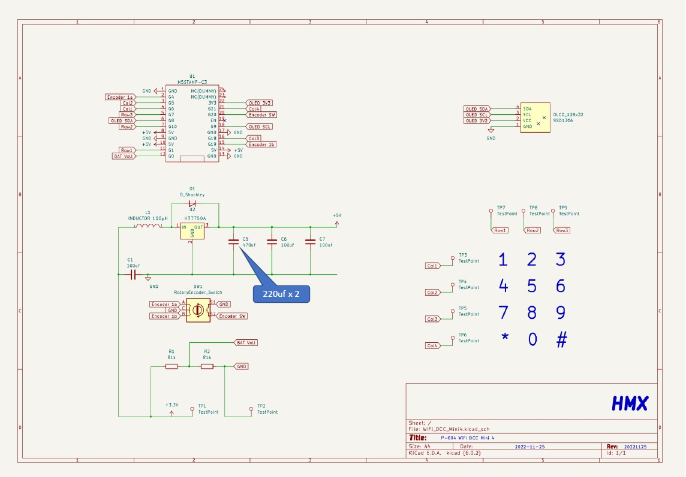

# WiTcontroller for ESP32C3

< Sttile under Modification >

< まだ未完成です！ >

I modified Mr Peter Akers' WiTcontroller so that it can be used with ESP32C3.
I should express my respect for his great accomplishment.
I'm new to forking on GIthub.
I would be very grateful if you could point out any mistakes.

Mr Peter AkersさんのWiTcontrollerをESP32C3で使えるように修正しました。
彼の偉大な功績に感謝しています。
私はGitHubでフォークをするのは初めてです。
なにか誤りがあれば、指摘して頂けると大変助かります。

<difference> 
Compared to ESP32, it has the following limitations: 
- Not scalable due to limited number of I/Os. 
- Returning from sleep requires turning the power back on. 

<違い> 
ESP32とに比較として次の制限があります。 
・I/Oの数が限定されるために拡張性がありません。 
・スリープからの復帰には電源の再投入が必要です。 

---
## HMX P008
*Photo01*

*Photo02*

## Prerequisites
TBA

## Building
TBA

## Using WiTController
TBA

### Command menu:
TBA

## Change Log

### V1.45
- Diverged from the original

### prior 
- various
